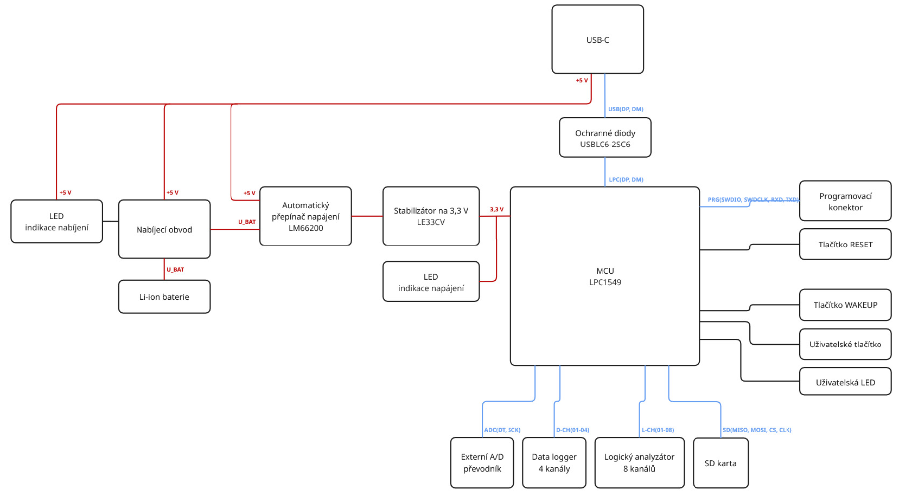

<!-- Toto je komentář a nebude zobrazen -->

# Univerzální logický analyzátor a data logger
> Semestrální práce

Cílem semestrální práce je návrh a následná realizace hardware univerzálního logického analyzátoru a data loggeru, v rámci bakalářské práce v letním semestru, bude tato práce rozšířena o implementaci firmware a tvorbu uživatelského rozhraní pro PC.

Logický analyzátor je zařízení určené pro sledování a následnou analýzu průběhu
krátkodobých diskrétních signálů, data logger naopak slouží k dlouhodobému záznamu jak digitálních, tak i analogových dat a signálů.

Jako řídící jednotka celého systému je použit mikrokontrolér NXP s jádrem ARM Cortex-M3, 12bitovým A/D převodníkem a zařízením USB 2.0 použitého pro komunikaci s PC. Pro generování časové značky jednotlivých záznamů slouží interní hodiny reálného času s externím krystalem. Součástí zařízení je i možnost připojení externího 24bitového A/D převodníku HX711. Pro uložení zaznamenaných dat je k dispozici SD karta bez filesystemu.

Kanály pro logický analyzátor a data logger jsou oddělené. Logický analyzátor má k dispozici osm kanálů, data logger je 4kanálový. Podpora 5\,V logiky na digitálních vstupech je prozatím zajištěna externě pomocí modulu převodníku napěťových úrovní.

Zařízení je možno napájet z USB, nebo lithium-iontového akumulátoru. Automatické přepínání napájení zajišťuje integrovaný obvod LM66200. Součástí napájecí části je i nabíjecí obvod s ochranou proti přebití, podvybití nebo zkratu akumulátoru.

## HARDWARE

Zařízení se skládá z řídící jednotky, ke které jsou připojeny kanály pro logický analyzátor a data logger, externí paměť ve formě SD karty a externí A/D převodník. Dále jsou k řídící jednotce připojeny uživatelská LED dioda určena pro zpětnou vazbu uživateli a tlačítka ve formě uživatelského tlačítka a tlačítka připojeného na Wakeup pin mikrokontroléru. Zpětnou vazbu při napájení zařízení a nabíjení akumulátoru poskytují další dvě LED diody. Nabíjení akumulátoru zajišťuje nabíjecí obvod popsaný níže. Napájení celého zařízení probíhá buťo pomocí akumulátoru, nebo přes USB-C. Přepínání zdrojů zajišťuje automatický přepínač napájení, ke snížení napájecího napětí na správnou úroveň pak slouží stabilizátor.

    
     
    <em>Blokový diagram</em>

## FIRMWARE

Tato část bude náplní především letního semestru, ale již teď je implementovám testovací firmware, který umí komunikovat s aplikací na PC pomocí USB a číst analogové hodnoty z jednoho vstupního kanálu data loggeru. Firmware je psaný v jazyce C, ve vývojovém prostředí MCUXpresso IDE, jako programátor a debugger je použit programátor SEGGER JLink.
Základem testovacího firmware jsou vzorové příklady projektu HID poskytnuté výrobcem mikrokontroléru NXP, do kterého je doplněna obsluha A/D převodníku a rozhodovací logika. Zpráva posílána do PC zatím obsahuje pouze hodnotu, kterou vrací A/D převodník.

    
     
    <em>Programování a debugging desky</em>

## SOFTWARE

Tato sekce je věnována návrhu aplikace a grafického prostředí pro konfiguraci, komunikaci s fyzickým zařízením a zpracování dat, která bude také řešena především v letním semestru.
Uživatelské rozhraní bude rozděleno do dvou částí - pro funkci logického analyzátoru a data loggeru. Rozhraní logického analyzátoru bude obsahovat grafické zobrazení zachycené komunikace, možnost analýzy častých komunikačních protokolů (sériová, SPI, I2C komunikace a další). Prostředí data loggeru bude podporovat export dat do formátu CSV, dále bude obsahovat funkce hledání maxima/minima, počítání aritmetického průměru a další funkce.
Aplikace pro obsluhu zařízení je psána v jazyce python v prostředí PyCharm, které dovoluje výběr interpreteru a knihoven přímo ze složky projektu. Díky tomu nedochází ke kolizím s verzemi knhoven nebo samotného pythonu. Pro tvorbu grafického rozhraní je použita knihovna PyQt5, komunikace se zařízením je řešena pomocí knihovny HID a k zápisu zaznamenaných dat do CSV souboru je použita knihovna CSV. 

Zatím je vytvořeno testovací uživatelské rozhraní, ve kterém je implementována funkce zaznamenávání analogových hodnot v reálném čase a to buďto v nastavených časových intervalech a nebo po stisknutí tlačítka. Zaznamenaná data jsou ukládána do souboru CSV a načtena a zobrazována v uživatelském rozhraní. V letním semestru bude aplikace rozšířena o funkci konfigurace zařízení pro funkci data loggeru bez nutnosti připojení k PC během zaznamenávání dat a uživatelské prostředí pro obsluhu logického analyzátoru. Dále budou do aplikace doplněny další funkce pro obsluhu data loggeru, jako například zaznamenávání digitálních hodnot, nebo nástroje pro analýzu dat a zpracování dat.

    
    
     
    <em>Uživatelské rozhraní pro automatické (vlevo) a manuální (vpravo) zaznamenávání dat</em>

